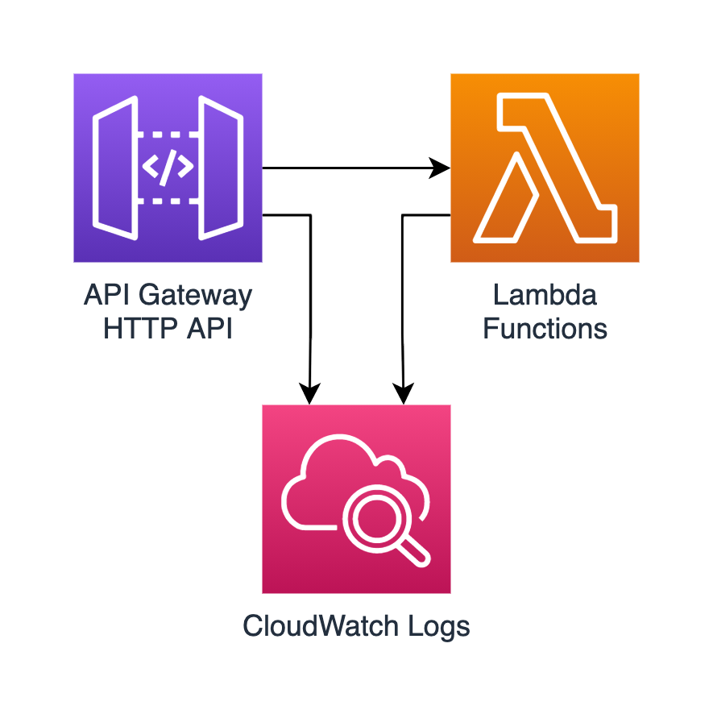

# AWS HTTP API + Lambda

This Terraform module deploys an HTTP API to AWS API Gateway. It also deploys one or more Lambda functions that you provide and integrates them with the API.



Example inputs for this module:

```lang-hcl
api_integrations = {
    "GET /" = "lambda1"
    "GET /pets" = "lambda2"
    "POST /pets" = "lambda1"
    "GET /pets/{petID}" = "lambda3"
    "GET /toys" = "lambda3"
}

lambda_functions = {
    lambda1 = {
        runtime = "nodejs14.x"
        handler = "index.handler"
        zip = "../lambda1.zip"
    }
    lambda2 = {
        runtime = "nodejs14.x"
        handler = "index.handler"
        zip = "../lambda2.zip"
    }
    lambda3 = {
        runtime = "python3.7"
        handler = "index.handler"
        zip = "../lambda3.zip"
    }
}
```
